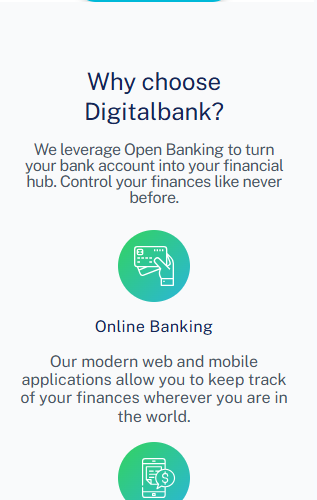
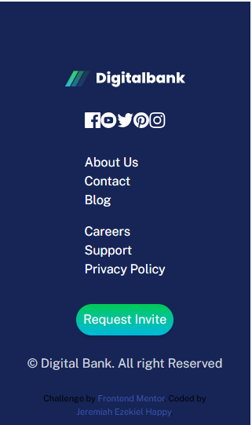
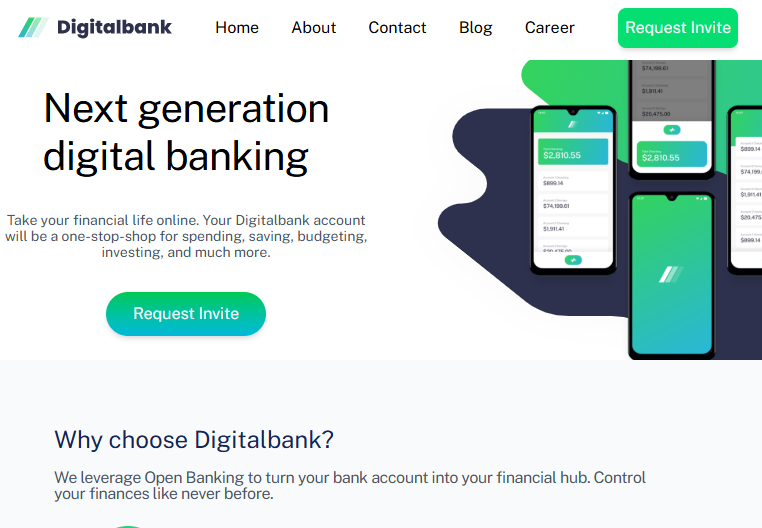
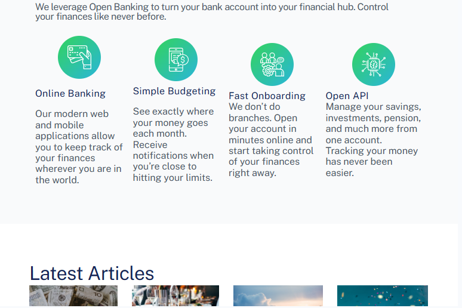
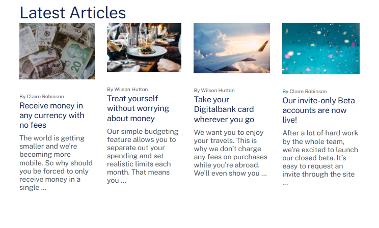
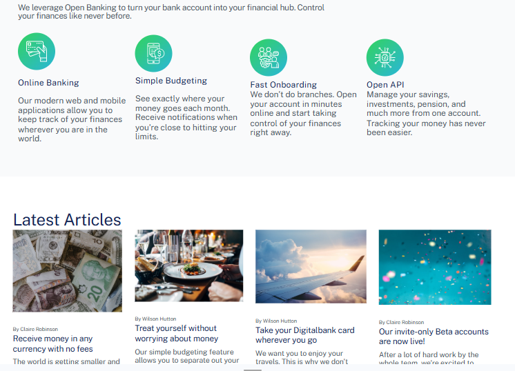

# Frontend Mentor - Digitalbank landing page solution

This is a solution to the [Digitalbank landing page challenge on Frontend Mentor](https://www.frontendmentor.io/challenges/digital-bank-landing-page-WaUhkoDN). Frontend Mentor challenges help you improve your coding skills by building realistic projects.

## Table of contents

- [Overview](#overview)
  - [The challenge](#the-challenge)
  - [Screenshot](#screenshot)
  - [Links](#links)
- [My process](#my-process)
  - [Built with](#built-with)
  - [What I learned](#what-i-learned)
  - [Continued development](#continued-development)
  - [Useful resources](#useful-resources)
- [Author](#author)

## Overview

### The challenge

Users should be able to:

- View the optimal layout for the site depending on their device's screen size
- See hover states for all interactive elements on the page

### Screenshot

### Links

- Solution URL: [Add solution URL here](https://your-solution-url.com)
- Live Site URL: [Add live site URL here](https://your-live-site-url.com)

## My process

### Built with

- Semantic HTML5 markup
- CSS custom properties
- Flexbox
- CSS Grid
- Mobile-first workflow
- [Tailwind](https://tailwindcss.com/docs) - For styles

### What I learned

Assumption is the worst form of learning. 
There is no assurance of learning until the subject matter becomes part of you

## Author

- Website - [Jeremiah Ezekiel Happy](https://www.zik.netlify.app)
- Frontend Mentor - [@doctorzik](https://www.frontendmentor.io/profile/yourusername)
- LinkedIn - [Ezekiel](https://www.linkedin.com/in/jeremiahezekiel/)

